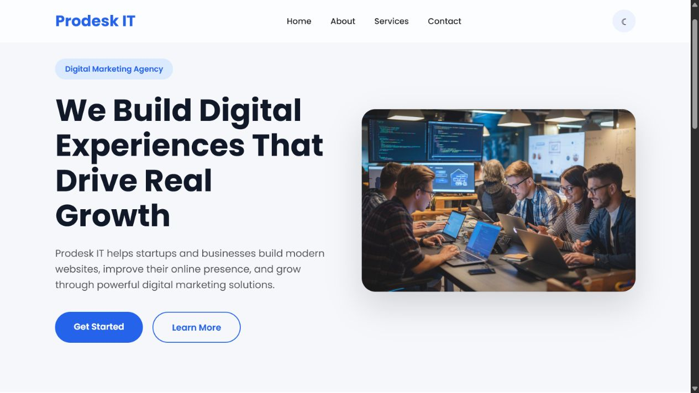

# Prodesk IT — Landing Page

A responsive digital-marketing landing page built with semantic HTML, raw CSS, and vanilla JavaScript for Prodesk IT Sprint 01.

## Links

- GitHub repository: https://github.com/Sumit07333/prodesk
- Live website: https://prodesk-pbym.vercel.app
- Demo video: _Add the 2–3 minute video URL before submission_

## Features

- Responsive sticky navigation with mobile hamburger menu
- Glassmorphism navbar using `backdrop-filter`
- Hero, About, Services, and Contact/Footer modules
- Three-card CSS Grid services layout
- Persistent dark/light theme using `localStorage`
- Button, card, navigation, and social-link micro-interactions
- Keyboard-friendly menu behavior and accessible labels
- No Bootstrap, Material UI, or Tailwind in the Phase 1/2 build

## Screenshot



## Project structure

```text
prodesk/
├── images/
│   └── hero.jpeg
├── index.html
├── style.css
├── script.js
├── README.md
└── Prompts.md
```

## Run locally

Open `index.html` directly in a browser, or serve the folder with any static development server.

## Deployment checklist

1. Push the final commit to the public GitHub repository above.
2. Import the repository into Vercel or Netlify and deploy it.
3. Add the live URL and a screenshot to this README.
4. Run Lighthouse on the deployed URL and record the scores.
5. Record the desktop/mobile/code-structure demo and add its link.

## Author

**Sumit Kumar** — IIT Patna  
Sprint 01 · Prodesk IT
